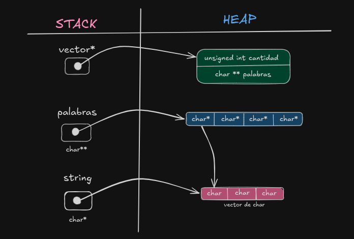

# TP0

## Información del estudiante

* Ailin Sofía Falcon
* 112231
* afalcon@fi.uba.ar

---

## Índice
* [1. Instrucciones](#1-Instrucciones)
  * [1.1. Compilar el proyecto](#11-Compilar-el-proyecto)
  * [1.2. Ejecutar las pruebas](#12-Ejecutar-las-pruebas)
  * [1.3. Ejecutar el programa con Valgrind](#13-Ejecutar-el-programa-con-Valgrind)
* [2. Funcionamiento](#2-Funcionamiento)
* [3. Estructura](#3-Estructura)
  * [3.1. Diagrama de memoria](#31-Diagrama-de-memoria)
* [4. Decisiones de diseño y/o complejidades de implementación](#4-Decisiones-de-diseño-yo-complejidades-de-implementación)
* [5. Respuestas a las preguntas teóricas](#5-Respuestas-a-las-preguntas-teóricas)

## 1. Instrucciones

> [!TIP]
> Se recomienda usar un Makefile y colocar en esta sección los comandos Make.

### 1.1. Compilar el proyecto
```bash
comando
```

### 1.2. Ejecutar las pruebas
```bash
comando
```

### 1.3. Ejecutar el programa con Valgrind
```bash
comando
```

## 2. Funcionamiento
El programa recibe un string y un separador especifíco, y separa las palabras delimitadas por el separador. Para esto, se crea un vector de strings, donde se guarda cada palabra encontrada dentro del string recibido. 

Para separar las palabras del texto recibido, se recorre el string, primero desde el comienzo, y luego a partir del ultimo separador encontrado y se guarda la palabra delimitada por el separador en un nuevo string. 

Cuando se terminan de insertar todas las palabras dentro del vector de strings, se define un struct que contiene la cantidad de palabras y el vector de strings.

<div align="center">
  
  <p>Diagrama de flujo del programa explicado con más detalle.</p>
</div>

## 3. Estructura
La estructura proporcionada tiene un vector de strings, donde se guardan las palabras que se separan del string recibido. Además tiene un campo llamado 'cantidad' que permite guardar la cantidad de palabras, para luego reservar la memoria que se utiliza en el vector de strings. 

### 3.1. Diagrama de memoria

<div align="center">
  
  <p>Diagrama de memoria de la estructura.</p>
</div>

## 4. Decisiones de diseño y/o complejidades de implementación
La mayor complejidad en el TP la encontré al momento de separar el string y guardar las palabras dentro del vector de string. Para esto, recorrí el string caracter por caracter hasta encontrar el separador, guardando en un puntero a un int la posición del separador para que sea el inicio de la siguiente búsqueda, y los guarde en un nuevo vector de char. Esto se repite hasta llegar al final del string. 

## 5. Respuestas a las preguntas teóricas

### 5.1. Explique cómo funcionan los strings en C
Un string es una cadena de caracteres usada para representar texto. Para guardar un string en C, se debe utilizar `char *`, que es un puntero a la primera posición del vector de caracteres (char). Para indicar el final de un string se utiliza `\0`. 

### 5.2. Explique el funcionamiento de las primitivas `malloc` y `free`.
Cuando utilizamos `malloc`, le estamos indicando al sistema operativo que queremos usar memoria del heap. Lo que hace es reservar memoria de una cantidad determinada de bytes para un tipo de dato, y devuelve un puntero a la dirección de memoria reservada.

Es importante que siempre que haya un llamado a `malloc`, luego hagamos una llamada a `free`, que es la función que se encarga de liberar esa memoria reservada previamente.